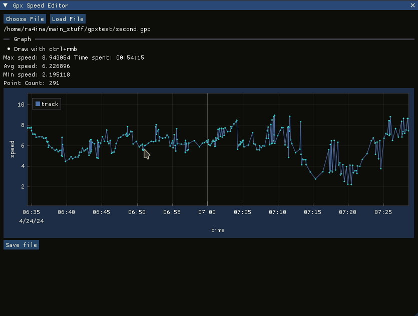

Gpx speed editor - edits speed of .gpx files... 
made using pugixml, implot and imgui using opengl backend

Choose .gpx file with "Choose File button". Then load it in, with "Load File" button.  
- Manipulate single point, by dragging it. 
- Or hold ctrl to 'draw' the curve yourself. 

After you are done, just press "Save File" button and it will save changes in current open file

---
Example workflow

---

To build you would need
- pugixml > 1.11 (if its lower you would need to update targets in cmake for pugixml from pugixml::pugixml to pugixml(but this was not tested))
- glfw3
- opengl